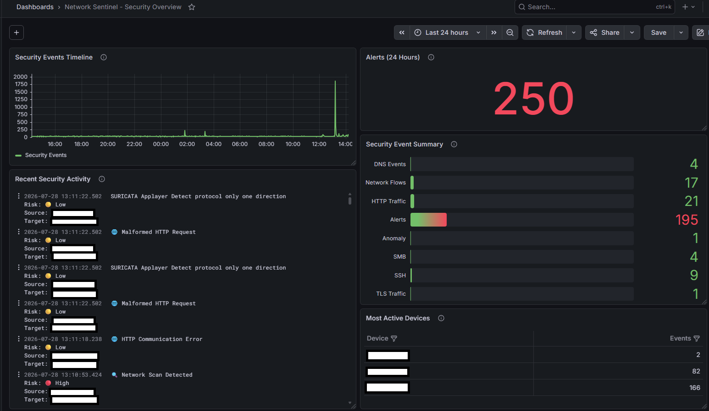
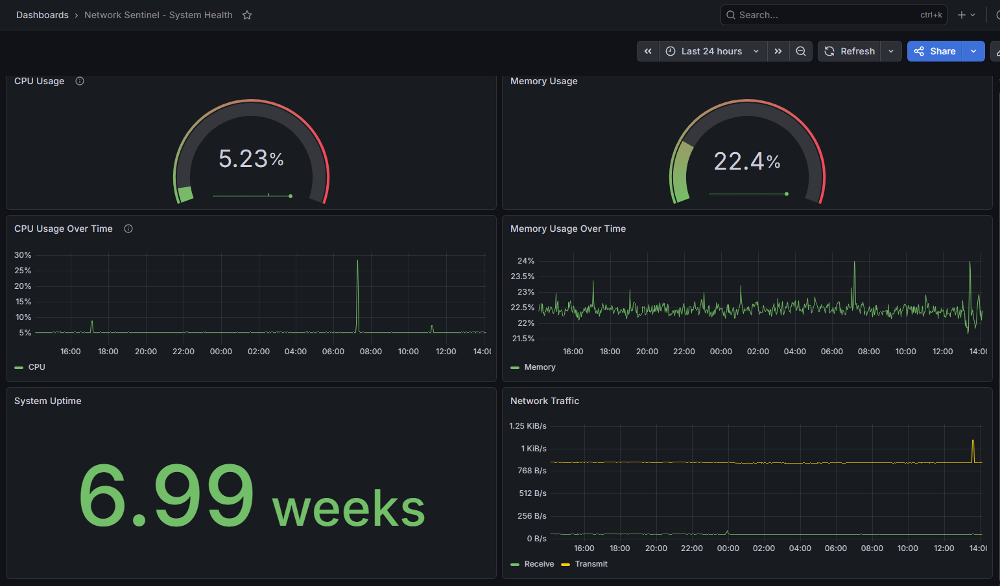
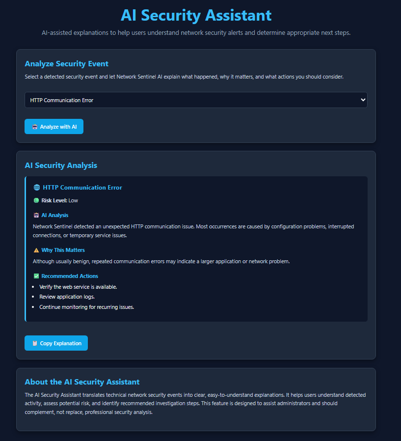

 ```                                                          
                           *%#%*                           
                       =%#=     -#%+                       
                 .#%%*-   .%%%%%:   :*%%#:                 
          .=#%%#-     -#%%%%%%%%%%%#=     -*%%#=.          
       %*:      =%%%%%%%%%%%%%%%%%%%%%%%%%+      :+%       
       %  #%%%%%%%%%%%%%%%%%%%%%%%%%%%%%%%%%%%%%%  %       
       %  %%%%%%%%%%%%%%%%%%%%%%%%%%%%%%%%%%%%%%%  %       
       %  %%%%:   :#%%%%%*   :%%%#+=========+%%%%  %       
       %  %%%%      %%%%%=    %%             %%%%  %       
       %: #%%%       #%%%=    %:    ::.:::::-%%%# .%       
       ** =%%%        *%%=    %.   %%%%%%%%%%%%%= **       
       :% .%%%         *%=    %.   #%%%%%%%%%%%%: %:       
        %  %%%          +=    %=          :#%%%%  %        
        #+ #%%     %          %%*           *%%# =#        
        +#  %%     %%.        %%%%%%%%%%=    %%  #=        
         %- *%     %%%        %%%%%%%%%%*    %* -%         
          %  ##    %%%%=      %*=======-    *%  %          
          -%  %+   %%%%%+     %:           =%: %-          
           #* .%*  %%%%%%+    %=..........=%- *#           
            %*  %%:%%%%%%%%   %%%%%%%%%%%%%: +%            
             *#  %%%%%%%%%%*  %%%%%%%%%%%%. #*             
              *#  %%%%%%%%%%% %%%%%%%%%%%  ##              
               :%: -%%%%%%%%%%%%%%%%%%%= .%:               
                 %*  %%%%%%%%%%%%%%%%%  +%                 
                  -%. :%%%%%%%%%%%%%=  %-                  
                    %#  =%%%%%%%%%+  #%                    
                      ##  =%%%%%*  ##                      
                        %*  =%+  *%                        
                          ##   *#                          
                            *%*                            
                                                           
```

# Network Sentinel

**AI-Assisted Network Security Monitoring for Small Business and Home Networks**

## Project Overview

Network Sentinel is a Dockerized network security monitoring platform originally developed as the IT599 IT Specialist Capstone Project for the Master of Science in Information Technology, Cybersecurity concentration, at Purdue Global.

The platform combines network monitoring, intrusion detection, centralized log collection, dashboard visualization, system health monitoring, and AI-assisted security explanations to help users better understand security events and network activity.

The graduate capstone implementation was successfully completed in August 2026. Continued post-capstone development is focused on improving the platform, deployment process, security architecture, and long-term real-world usability.

---

## Dashboard Previews

### Security Overview Dashboard

The Security Overview Dashboard displays live security events collected by Suricata IDS and visualized through Grafana. It provides a centralized view of recent alerts, event categories, alert counts, and security activity across the monitored network.

> Sensitive information has been redacted from the screenshot.



### System Health Dashboard

The System Health Dashboard provides administrators with a real-time view of the monitoring platform. It displays CPU utilization, memory utilization, system uptime, historical performance trends, and network throughput to help verify that Network Sentinel is operating reliably.



### AI Security Assistant

The AI Security Assistant translates technical security events into plain-English explanations. Users can select a detected security event and receive an easy-to-understand description, an assigned risk level, an explanation of why the event matters, and recommended investigation steps.



---

## Features

* Real-time network security monitoring
* Suricata intrusion detection
* Grafana security dashboards
* Prometheus system monitoring
* Loki centralized log collection
* Promtail log forwarding
* AI-assisted security explanations
* Interactive monitoring portal
* Dockerized deployment
* System and service health monitoring
* Centralized security event analysis

---

## Technology Stack

### Platform

* Ubuntu Server
* Docker
* Portainer

### Security Monitoring

* Suricata IDS

### Observability

* Grafana
* Prometheus
* Loki
* Promtail
* Uptime Kuma
* Node Exporter
* cAdvisor

### Application Components

* Flask API
* HTML
* CSS
* JavaScript
* AI-assisted security analysis

---

## Architecture

Network Sentinel uses a containerized architecture that separates network monitoring, log collection, system monitoring, visualization, and application services.

At a high level:

```text
Network Traffic
      |
      v
 Suricata IDS
      |
      v
   Promtail
      |
      v
     Loki
      |
      +-------------------+
      |                   |
      v                   v
   Grafana        Network Sentinel API
                          |
                          v
                  AI Security Assistant
                          |
                          v
                  Web Monitoring Portal
```

Prometheus, Node Exporter, and cAdvisor provide system and container health metrics, while Uptime Kuma provides service availability monitoring.

---

## Project Goals

The original capstone project was designed to:

* Monitor network and system activity
* Detect suspicious network behavior
* Visualize security events and system metrics
* Provide AI-assisted security alert explanations
* Demonstrate networking knowledge
* Demonstrate cybersecurity knowledge
* Demonstrate Linux administration skills
* Demonstrate Docker containerization
* Demonstrate monitoring and observability concepts
* Demonstrate security event analysis
* Produce professional technical documentation

---

## Intended Audience

### Primary

* Small business IT administrators
* Small organizations without dedicated cybersecurity personnel

### Secondary

* Homelab enthusiasts
* Advanced home users
* Remote workers

---

## Capstone Status

**✅ Graduate Capstone Completed — August 2026**

The original Network Sentinel capstone implementation included:

* Dockerized project architecture
* Suricata IDS deployment
* Prometheus monitoring stack
* Loki and Promtail centralized logging
* Grafana Security Overview dashboard
* Grafana System Health dashboard
* Node Exporter and cAdvisor monitoring
* Uptime Kuma service monitoring
* Interactive Network Sentinel web portal
* Flask-based backend API
* AI Security Assistant prototype
* Live Suricata security event retrieval
* AI-assisted security event analysis
* Professional deployment documentation
* Testing documentation
* Architecture documentation
* Administrator instructions
* Final project report and presentation

---

## Post-Capstone Development

Network Sentinel continues as a personal cybersecurity and software development project beyond the completed graduate capstone.

Future development areas may include:

* Improved deployment automation
* Secure remote telemetry
* Multi-environment monitoring
* Improved authentication and access control
* Customer-friendly security reporting
* Enhanced alert processing
* Additional security dashboards
* Improved AI-assisted event analysis
* Deployment and configuration hardening

The completed capstone remains the technical foundation for future versions of Network Sentinel.

---

## Project Scope

Network Sentinel is an educational and prototype security monitoring platform.

It is not currently intended to replace:

* Enterprise SIEM platforms
* Endpoint Detection and Response systems
* Managed Detection and Response providers
* Professional incident response services
* Full Managed Service Provider environments

Network Sentinel does not guarantee the prevention or detection of every cybersecurity threat.

---

## Repository

This repository contains the source code, configuration, technical documentation, screenshots, and development artifacts associated with the Network Sentinel project.
